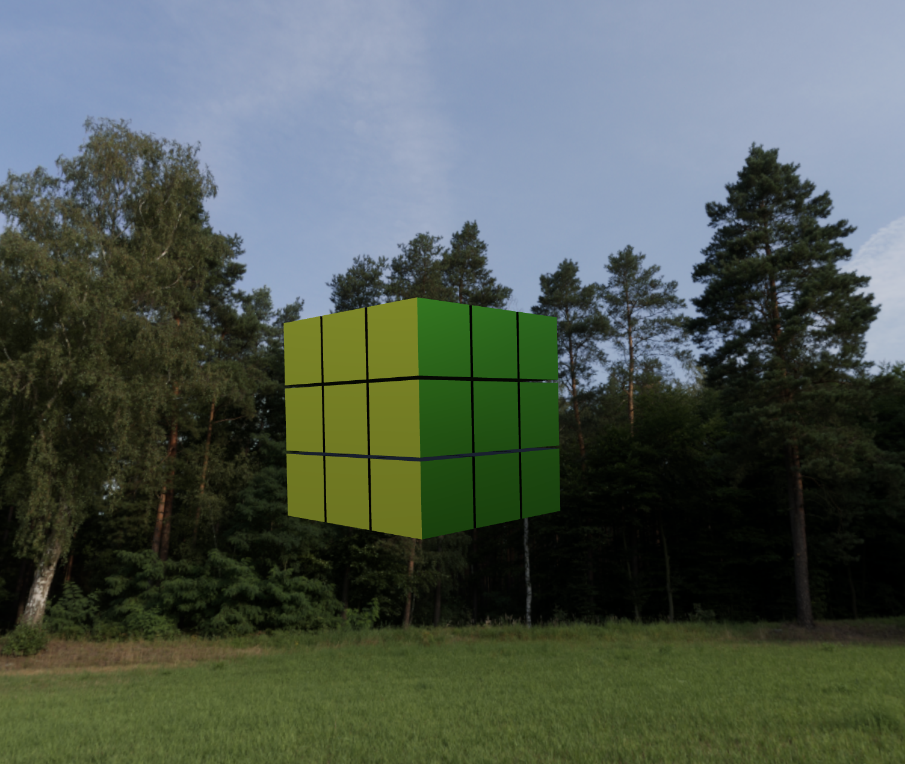

## Getting Started

Install the dependencies:

```bash
npm install
# or
yarn install
```

Then, run the development server:

```bash
npm run dev
# or
yarn dev
```

Open [http://localhost:3000](http://localhost:3000) with your browser to see the result.

Use your Mouse to Control the Environment to Zoom and Rotate

Coming Soon: Functionality to Rotate Faces



